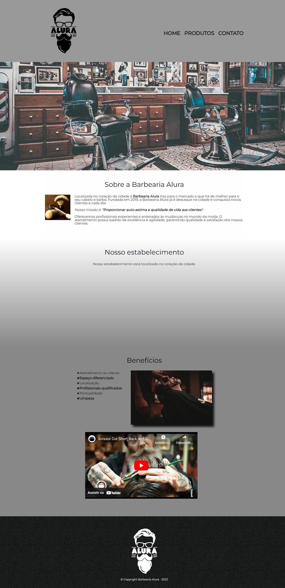

<h1 align="center"> BARBEARIA ALURA </h1>

Projeto feito na Formação da Alura HTML E CSS.

  <a href="#-tecnologias">Tecnologias</a>&nbsp;&nbsp;&nbsp;|&nbsp;&nbsp;&nbsp;
  <a href="#-projeto">Projeto</a>&nbsp;&nbsp;&nbsp;|&nbsp;&nbsp;&nbsp;
 <a href="#memo-licença">Licença</a>

  

 

  

## 🚀 Tecnologias

Esse projeto foi desenvolvido com as seguintes tecnologias:

- HTML e CSS
- Git e Github

## 💻 Projeto

Uma página da web, tabalhando com posicionamento, listas, tabelas, navegação, formulários e CSS avançado.

## :memo: Licença

Esse projeto está sob a licença MIT.

